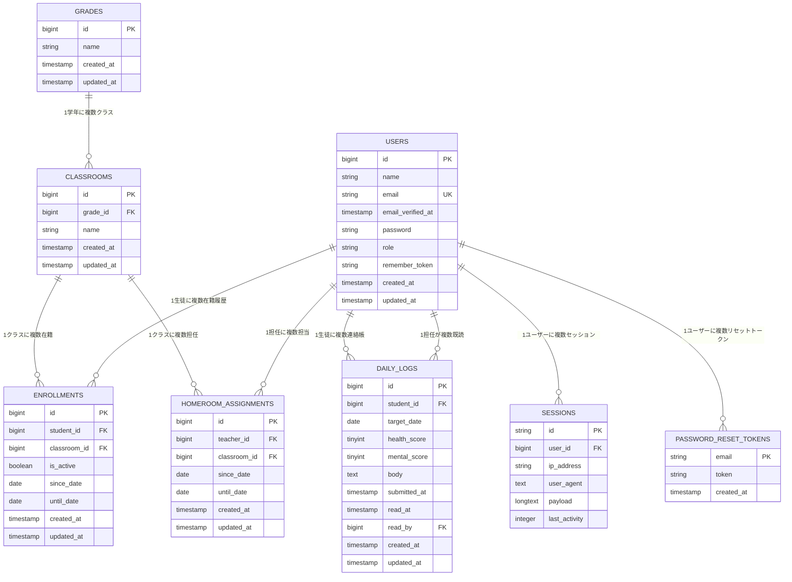

# ER図（Entity Relationship Diagram）

## 概要
ContactBook アプリケーションのデータベース設計図です。
生徒の連絡帳提出システムにおける各エンティティ間の関係を表現しています。

---

## ER図



---

## テーブル詳細

### 1. USERS（ユーザー）
- **役割**: システムの全ユーザー（管理者・担任・生徒）を管理
- **主キー**: `id`
- **ユニーク制約**: `email`
- **インデックス**: `role`（検索最適化）
- **役割**: `admin`, `teacher`, `student`

### 2. GRADES（学年）
- **役割**: 学年情報を管理（1年、2年、3年）
- **主キー**: `id`
- **特徴**: シンプルなマスターテーブル

### 3. CLASSROOMS（クラス）
- **役割**: クラス情報を管理（1年A組、2年B組など）
- **主キー**: `id`
- **外部キー**: `grade_id` → `GRADES.id`
- **インデックス**: `(grade_id, name)`（検索最適化）

### 4. ENROLLMENTS（在籍）
- **役割**: 生徒のクラス在籍履歴を管理
- **主キー**: `id`
- **外部キー**: 
  - `student_id` → `USERS.id`
  - `classroom_id` → `CLASSROOMS.id`
- **インデックス**: `(student_id, classroom_id)`
- **特徴**: 履歴管理（転校・転クラス対応）

### 5. HOMEROOM_ASSIGNMENTS（担任割当）
- **役割**: 担任のクラス担当履歴を管理
- **主キー**: `id`
- **外部キー**: 
  - `teacher_id` → `USERS.id`
  - `classroom_id` → `CLASSROOMS.id`
- **インデックス**: `(teacher_id, classroom_id)`
- **特徴**: 履歴管理（担任変更対応）

### 6. DAILY_LOGS（連絡帳）
- **役割**: 生徒の連絡帳提出内容を管理
- **主キー**: `id`
- **外部キー**: 
  - `student_id` → `USERS.id`
  - `read_by` → `USERS.id`（既読した担任）
- **ユニーク制約**: `(student_id, target_date)`（同一日の重複提出防止）
- **特徴**: 既読管理、スコア評価（1-5段階）

### 7. PASSWORD_RESET_TOKENS（パスワードリセット）
- **役割**: パスワードリセット用トークン管理
- **主キー**: `email`
- **特徴**: Laravel標準の認証機能

### 8. SESSIONS（セッション）
- **役割**: ユーザーセッション管理
- **主キー**: `id`
- **外部キー**: `user_id` → `USERS.id`
- **特徴**: Laravel標準のセッション機能

---

## 主要な関係性

### 1. 階層構造
```
GRADES (学年)
  └── CLASSROOMS (クラス)
      ├── ENROLLMENTS (在籍)
      └── HOMEROOM_ASSIGNMENTS (担任割当)
```

### 2. ユーザー関連
- **生徒**: `USERS` → `ENROLLMENTS` → `CLASSROOMS`
- **担任**: `USERS` → `HOMEROOM_ASSIGNMENTS` → `CLASSROOMS`
- **管理者**: `USERS`（直接管理権限）

### 3. 連絡帳フロー
```
USERS (生徒) → DAILY_LOGS (提出)
USERS (担任) → DAILY_LOGS (既読)
```

---

## 設計のポイント

### 1. **履歴管理**
- `ENROLLMENTS`: 生徒の転校・転クラス履歴
- `HOMEROOM_ASSIGNMENTS`: 担任の変更履歴
- `since_date`, `until_date` で期間管理

### 2. **データ整合性**
- 外部キー制約で参照整合性を保証
- `cascadeOnUpdate`, `restrictOnDelete` で適切な制御

### 3. **パフォーマンス**
- 検索頻度の高いカラムにインデックス設定
- 複合インデックスで効率的な検索

### 4. **ビジネスロジック**
- `(student_id, target_date)` のユニーク制約で重複提出防止
- `is_active` フラグで現在の在籍状況管理
- スコア評価（1-5段階）で定量的な評価

---

## 拡張性

### 今後の拡張案
1. **祝日管理**: カレンダーテーブルの追加
2. **通知機能**: 通知テーブルの追加
3. **ファイル添付**: 添付ファイルテーブルの追加
4. **コメント機能**: 担任コメントテーブルの追加